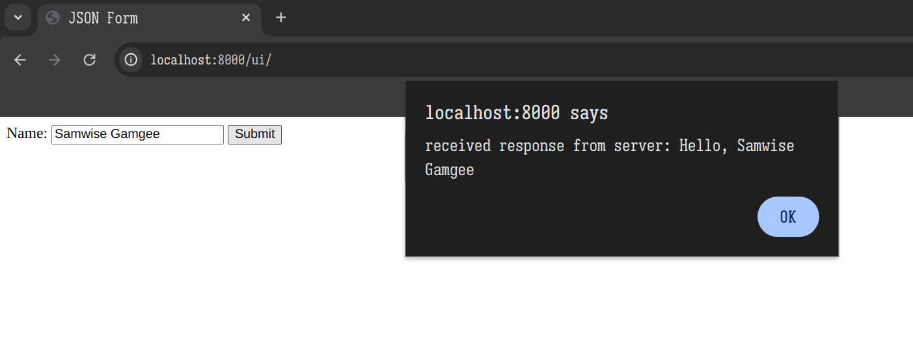

# Windows WSL Test Project

## Getting Started

1. Ensure you have WSL installed. Consult the Microsoft documentation: [https://learn.microsoft.com/en-us/windows/wsl/install](https://learn.microsoft.com/en-us/windows/wsl/install)

    For your installation, use Ubuntu. If you need to specify a version, 22 or 24 should work nicely with this project.

2. Clone this repository.

3. Within WSL, run

    ```sh
    ./hello-server-linux-amd64 -external node/main.js
    ```

    A webserver starts on port 8000. You may change the port:

    ```sh
    ./hello-server-linux-amd64 -port 9876 -external node/main.js
    ```

4. Visit the running webserver and interact with the UI. Here is a sample of a working setup.


